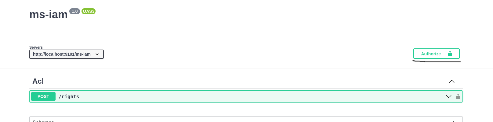
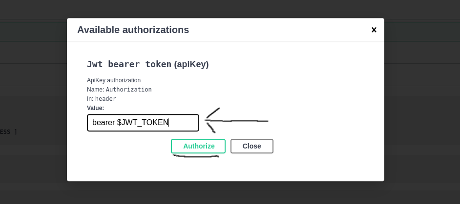
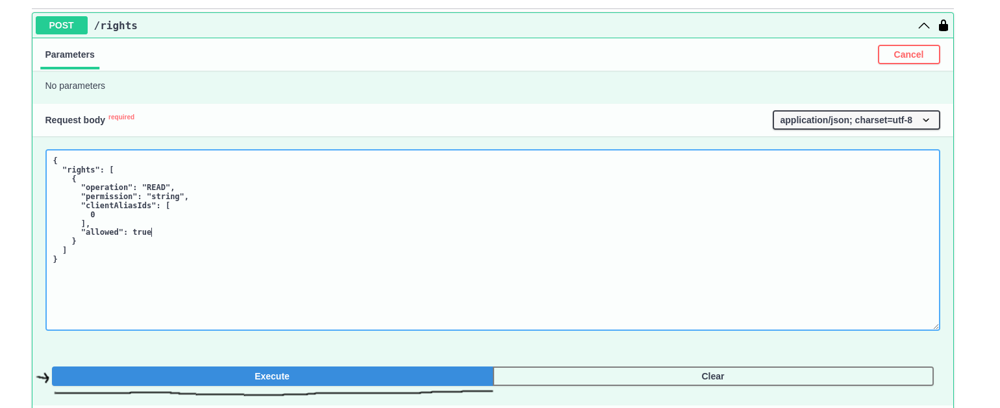

# Calling the Micro-service via HTTP

## REST API Endpoints

### `POST` /ms-iam/rights

#### Description

This endpoint verifies whether a user has access to a specific feature. Additionally, it supports checking access rights for features owned by a colleague.

#### Authorization

Access to this endpoint requires a **Bearer token** containing a JWT. The JWT must include information about the user for whom the request is being made.

- JWT Requirements:
  - The JWT payload must contain:
    - `caid` (Client Alias ID)
    - `gid` (Group ID)
- Token Generation:
  - A valid JWT can be automatically generated using the [sign_jwt.sh](./cli-usage.md) script.

#### Request Body

- **Content Type:** `application/json`

- **Example JSON Request:**

  ```json
  {
    "rights": [
      {
        "operation": "READ",
        "permission": "payments",
        "clientAliasIds": [2, 3]
      }
    ]
  }
  ```

- **Request Parameters:**

  - **`operation`**: Defines the requested operation. Accepted values: `READ` | `EDIT` | `DELETE` | `ACCESS`.
  - `permission`: Specifies the required permission.
    - A full list of available permissions is stored in the `acl.permissions` table (PostgreSQL).
    - **Note:** For more details on permissions, refer to [Managing Permissions](./managing-permissions.md) and [Access Right Merging](./access-right-merging.md).
  - **`clientAliasIds`**: A list of **Client Alias IDs** representing colleagues for whom the permission check is performed.

#### API Documentation

A full Swagger UI interface is available at: `http://localhost:9101/ms-iam/docs`


## Using Swagger UI to call API endpoints

This project includes **OpenAPI** support, which is **automatically generated** from the **Rust code** using [Poem OpenAPI](https://github.com/poem-web/poem/blob/master/poem-openapi/README.md). This feature enhances developer productivity and eliminates **code duplication** between the **backend Rust code** and API documentation. The **documentation page** is generated using [Swagger UI](https://swagger.io/tools/swagger-ui/). Once you run the project using Docker, it will be available at:

`http://localhost:9101/ms-iam/docs`.

**Swagger UI** enables you to **test API endpoints** with just a few clicks.


### Steps to Use Swagger UI

### 1. Visit [Swagger UI URL](http://localhost:9101/ms-iam/docs) and click  **"Authorize"** button




### 2. Enter the Authorization Header value

- **Format**: `bearer ${YOUR_JWT_TOKEN}`



### 3. Expand **/rights** API endpoint and click  **"Try it out"**


### 4. Provide the Desired Request Body and Click **"Execute"**




# Calling the Micro-service via gRPC

- TODO ( Add Grpc usage docs )


